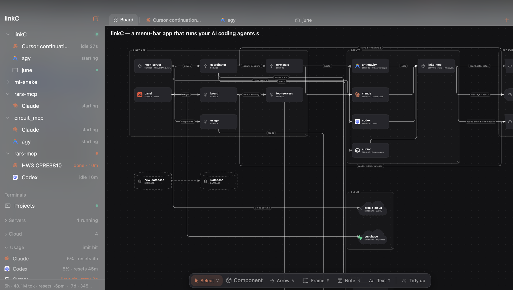
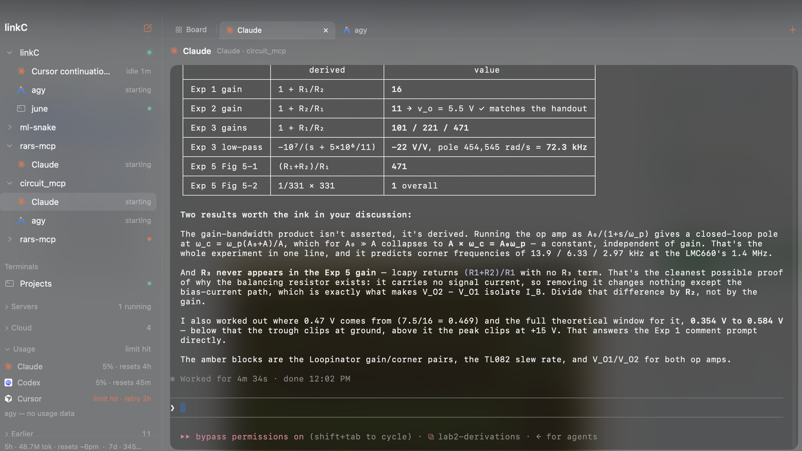
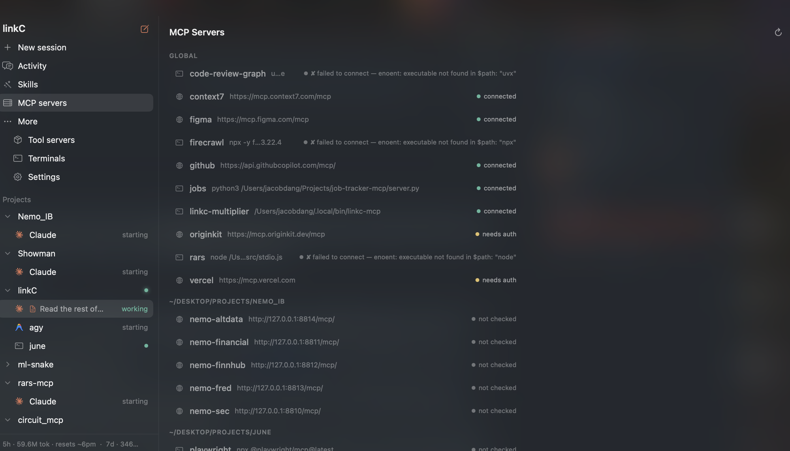

# linkC

linkC is a macOS menu-bar app that runs your AI coding agents in one place. Each agent runs in
its own terminal inside a glass panel. linkC shows which agents work and which agents need you.
The agents can also send tasks and messages to each other.

In this README:

- An **agent** is an AI coding CLI: Claude Code, Codex, Antigravity or Cursor Agent.
- A **session** is one agent that runs in a linkC terminal.
- A **terminal** is a plain shell, for example for a dev server.
- A **project** is the folder where sessions and terminals run.

**The Board.** Each project has a Board: a diagram of the system that you and your agents make
together.



**A session.** An agent session in its terminal. The sidebar groups the sessions by project and
shows the usage at the bottom.



**MCP servers.** The MCP servers that your agents use, with the connection status of each
server.



## Supported agents

| Agent | Command | How linkC knows the session state |
|---|---|---|
| Claude Code | `claude` | Claude Code hooks send each event to a local HTTP server in linkC. |
| Codex | `codex` | linkC reads the terminal screen one time each second. |
| Antigravity | `agy` | linkC reads the terminal screen one time each second. |
| Cursor Agent | `cursor` | linkC reads the terminal screen one time each second. |

## Features

### The panel

- linkC has no Dock icon. Click the menu-bar icon to open the panel.
- The panel opens in the top-right corner of the display where you used it last.
- To open the panel from the keyboard, select a shortcut in **Settings > Shortcut**. The
  options are ⌥ Space, ⌃⌥ Space, ⇧⌘ L and ⌥⌘ C.
- Drag the top of the panel to move it. Drag an edge or a corner to change its size.
- The sidebar has these sections: **Projects**, **Terminals**, **Servers**, **Cloud**, **Usage**
  and **Earlier**.

### Projects and sessions

- The sidebar groups the sessions and terminals of each project.
- Each project has a tab strip: the Board first, then one tab for each session and terminal.
  Press ⌘1 for the Board. Press ⌘2 to ⌘9 for the other tabs.
- To start an agent in a project, use the **+** menu of the project.
- **New session**, **Continue last** and **Resume…** use the history of each agent. Thus, they
  also find sessions that you started outside linkC.
- The **Earlier** section keeps the sessions and terminals that ended. Click one to start it
  again.
- When you quit linkC, it asks first if sessions or terminals still run. Quitting stops them.

### Terminals

- A terminal runs your login shell in a folder. To open a terminal in a project, use
  **New terminal** in the **+** menu of the project.
- To file a terminal under a project, drag the terminal onto the project.
- To remove a terminal from its project, drag it onto the **Terminals** label. You can also use
  **Move out of** in its context menu.
- A plain terminal shows the name of its current folder. After `cd Sources`, its name is
  `Sources`. The home folder shows as `~`.
- A terminal that is not filed shows under the project whose folder is its current folder. Thus,
  when you `cd` into a different project, the terminal moves to that project. A subfolder of a
  project is not part of that project.
- A filed terminal stays in its project when you `cd`. All other terminals show in the
  **Terminals** section.
- A terminal that runs a command, for example `docker logs`, keeps its name and its folder.
- linkC saves the current folder of each terminal. A terminal that you start again opens in
  that folder.
- A terminal that exits stays in the sidebar with its output until you dismiss it.

### App tabs

- A project can open a local web app in a tab. The app tab shows in the tab strip after the
  sessions and terminals.
- To open an app, use the **Apps** section of the **+** menu of the project.
- linkC starts the app when you open its tab. The app runs until you close the tab or quit linkC.
  Then linkC stops the app and every process that the app started.
- linkC never starts an app by itself. After linkC restarts, an app tab shows **Not running**
  until you click **Start**.
- If linkC stops unexpectedly, the next launch stops the apps that were still running.
- If an app cannot start, the tab shows the reason and the last lines of the app output.
- **Settings > Apps** adds apps that every project can open.

### The Board

- linkC keeps the Board of a project in `system-map.json`, in the root folder of the project.
- The tools are **Select** (V), **Component**, **Arrow** (A), **Frame** (F), **Note** (N) and
  **Text** (T). **Tidy up** arranges the full diagram by its flow.
- There are three groups of component kinds:
  - **System**: database, cache, queue, storage, service, host and external.
  - **AI agents**: agent, model, tool, MCP server, router, start, end, vector store, memory,
    prompt, state and human.
  - **Hardware**: ALU, MUX, DEMUX, register, RAM, control unit, adder, decoder, clock and bus.
- An arrow can be plain, conditional, control or bus. A bus arrow can show its width in bits.
- A component can show the logo of its technology, for example PostgreSQL, Redis or Docker.
- Agents read and edit the Board through the linkC MCP server. After an agent edits the Board,
  linkC arranges the diagram again.

### Agents that work together

linkC includes an MCP server, `linkc-mcp`, with the name `linkc-multiplier`. Each agent can use
its tools to give work to other agents and to share information.

| Tool | Purpose |
|---|---|
| `linkc_delegate_task` | Give a task to another agent, with an optional model tier and verification. |
| `linkc_start_task` | Accept a task that linkC delivered. |
| `linkc_complete_task` | Report a task as done or failed. |
| `linkc_cancel_task` | Cancel a task. |
| `linkc_get_task` | Show the full record of a task. |
| `linkc_my_tasks` | List your open tasks. |
| `linkc_send_message` | Send a message to another agent. |
| `linkc_get_inbox` | Show the queued messages and the active agent limits. |
| `linkc_post_note` | Post a note that all agents in the project can read. |
| `linkc_broadcast_intent` | Tell the other agents your goal and your files. |
| `linkc_check_conflicts` | Find out if another agent claims a file. |
| `linkc_get_project_context` | Show the Board, and the goals and notes of the other agents. |
| `linkc_get_board`, `linkc_edit_board` | Read or edit the Board. |
| `linkc_get_models`, `linkc_switch_model` | List the models of an agent, or change its model. |
| `linkc_get_usage_status` | Show the usage that each agent has left. |

How linkC delivers the work:

- linkC types each task and message into the terminal of the agent that receives it. All the
  messages for one agent go in one paste.
- A task can have a model tier: light, standard or deep. Set the model for each tier in
  **Settings > Models**.
- A verified task includes a test command. linkC runs the tests itself. The tests must fail
  before the work and pass after it.
- When an agent reaches its usage limit, linkC moves its task to another available agent. linkC
  never sends the task back to the agent that gave it.
- A task can stop: no start after 10 minutes, a question to you for 5 minutes, or no screen
  change for 15 minutes. Then linkC tells you and the agent that gave the task.

### Usage and limits

- The **Usage** section shows how much each agent has left, for example in its 5-hour and 7-day
  windows.
- linkC reads the Claude Code usage from the local transcripts in `~/.claude/projects`. It reads
  the Codex usage from the session files in `~/.codex/sessions`.
- linkC does not send usage data over the network.
- Cursor Agent and Antigravity keep no local usage records. For these agents, linkC shows a
  limit only when the limit message appears in the terminal.

### Notifications

- The menu-bar icon turns coral when a session is done or needs your input.
- linkC sends a macOS notification only when you do not watch that session. You watch a
  session when the panel is open, linkC is active, and the tab of that session is selected.
- Click a notification to open its session.

### Other screens

- **Activity**: a timeline of agent events, and a summary for each agent.
- **Skills**: the skills that are installed for your agents.
- **MCP servers**: the global and project MCP servers of your agents, with their connection
  status.
- **Tool servers**: your Docker containers and Compose projects. Start, stop or restart them,
  and open their logs in a terminal.
- **Settings**: launch at login, the keyboard shortcut, the models for each tier, the usage
  footer and the watched endpoints.
- The **Servers** section shows your running Docker servers.
- The **Cloud** section shows your Oracle Cloud instances, your Supabase projects and the
  endpoints that you watch.

## Build an app for linkC

An app for linkC is a local web app. linkC starts its server and shows its page in a tab.

1. Make the user interface of the app a web page that a local HTTP server supplies.
2. Add the file `.linkc/app.json` to the root folder of the app:

   ```json
   {
     "name": "Circuit MCP",
     "start": ["uv", "run", "python", "run_ui.py", "--port", "{port}"],
     "health": "/api/status"
   }
   ```

| Field | Required | Contents |
|---|---|---|
| `name` | Yes | The name of the tab and of the menu item. |
| `start` | Yes | The command and its arguments. linkC runs the command in the root folder of the app, through your login shell. linkC replaces each `{port}` with a free port. |
| `health` | Yes | A path that starts with `/`. It returns a 2xx status when the app is ready. |
| `path` | No | The page that linkC opens. The default is `/`. |
| `env` | No | Environment variables for the app. |
| `port` | No | A preferred port, from 1024 to 65535. linkC uses it when it is free. Then the page keeps the same origin, and its local storage, from one start to the next. |

The server must obey these rules:

- Listen only on `127.0.0.1`, on the port that linkC gives. linkC also sets `LINKC_PORT`.
- Return a 2xx status from the `health` path within 60 seconds of the start.
- Stop within 5 seconds of SIGTERM. After 5 seconds, linkC sends SIGKILL to all the processes of
  the app.
- Write logs to stdout and stderr.
- Keep data on disk. linkC stops the app when you close its tab.

linkC keeps its own data in the `.linkc` folder of a project. If your repository ignores `.linkc/`,
change that rule to `.linkc/*` and add the rule `!.linkc/app.json`.

Optional: use a dark background. The page URL includes `linkc=1`, so the app can hide its own
header when it runs in linkC.

## Requirements

- macOS 14 or later.
- Claude Code, with `claude` on your PATH. linkC does not start without it.
- Optional: Codex (`codex`), Antigravity (`agy`) and Cursor Agent (`cursor`). linkC can start
  an agent only when its command is installed.
- Optional: Docker for the **Servers** section, and the `oci` CLI for Oracle Cloud.

## Build and test

```sh
swift build   # compile
swift test    # run the unit and integration tests
```

## Install and run

1. Render the app icon. Do this one time, and again after you change the icon:

   ```sh
   ./scripts/make-icon.sh
   ```

2. Quit linkC if it runs. Then build the app and install it in `/Applications`:

   ```sh
   ./build-app.sh --install
   ```

3. Start linkC:

   ```sh
   open /Applications/linkC.app
   ```

4. Register the MCP server with your agents. Do this one time:

   ```sh
   ~/.local/bin/linkc-mcp --install
   ```

   This step adds `linkc-multiplier` to the MCP configuration of Claude Code, Codex, Antigravity
   and Cursor Agent.

5. When macOS asks for notification permission, allow it.

### Update a running copy

Run `./build-app.sh` without `--install` to build `dist.noindex/linkC.app` only. When that
build is newer than the running app, the sidebar footer shows an update button. Click it to
install the new build. linkC restarts. Restart your sessions from the **Earlier** section.

### Signing

The app has an ad-hoc signature. On the Mac that built it, `open` starts it. On a different
Mac, Gatekeeper blocks the first start. Right-click the app, then click **Open**.

## Source layout

| Folder | Contents |
|---|---|
| `Sources/LinkCKit/App` | The coordinator: sessions, the relay that delivers tasks and messages, the watchdog and updates. |
| `Sources/LinkCKit/Apps` | App tabs: the app manifest, the app catalog, the app process and the record of running apps. |
| `Sources/LinkCKit/Blackboard` | The shared state of a project: the inbox, tasks, messages, notes and handoffs. |
| `Sources/LinkCKit/Board` | The Board model: edits, merges, layout, arrow routing, component kinds and logos. |
| `Sources/LinkCKit/Config` | Integrations: Docker, Oracle Cloud, Supabase, MCP server health, skills and watched endpoints. |
| `Sources/LinkCKit/Core` | Domain models, agent kinds, model tiers, the session store and project grouping. |
| `Sources/LinkCKit/Git` | The Git commands for verified tasks. |
| `Sources/LinkCKit/Hooks` | Claude Code hooks: the event decoder, the local HTTP server and the settings composer. |
| `Sources/LinkCKit/MCP` | The MCP protocol, the `linkc-multiplier` tools and their registration. |
| `Sources/LinkCKit/Notify` | The focus rule and the notification delivery. |
| `Sources/LinkCKit/Preferences` | App preferences, the panel display choice and the sidebar state. |
| `Sources/LinkCKit/Terminal` | Embedded terminals, dev shells and process inspection. |
| `Sources/LinkCKit/Usage` | The usage readers for each agent, and the usage formats. |
| `Sources/LinkCKit/Verification` | The test runner for verified tasks. |
| `Sources/linkc` | The menu-bar app: the status item, the panel, the sidebar and the keyboard shortcut. |
| `Sources/linkc/Board` | The Board canvas, its tools and the project tab strip. |
| `Sources/linkc/Screens` | The Activity, Skills, MCP servers, Tool servers, Terminals and Settings screens. |
| `Sources/linkc-mcp` | The `linkc-mcp` executable. |
| `Tests/LinkCKitTests` | The unit and integration tests. |
| `scripts` | The app icon renderer, the agent skill sync script and the ThreadSanitizer script. |
