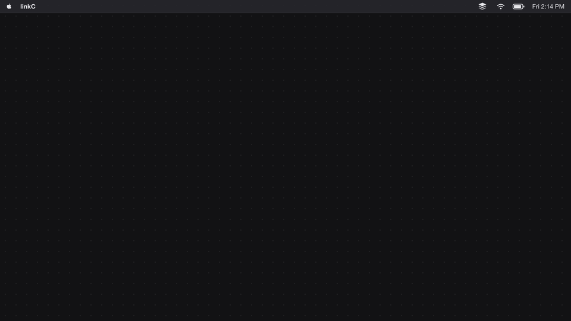
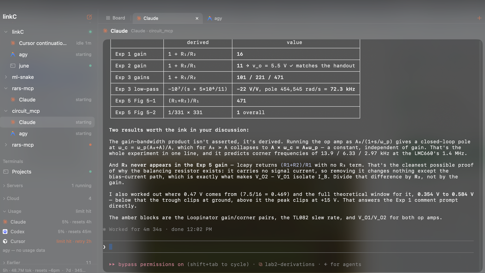
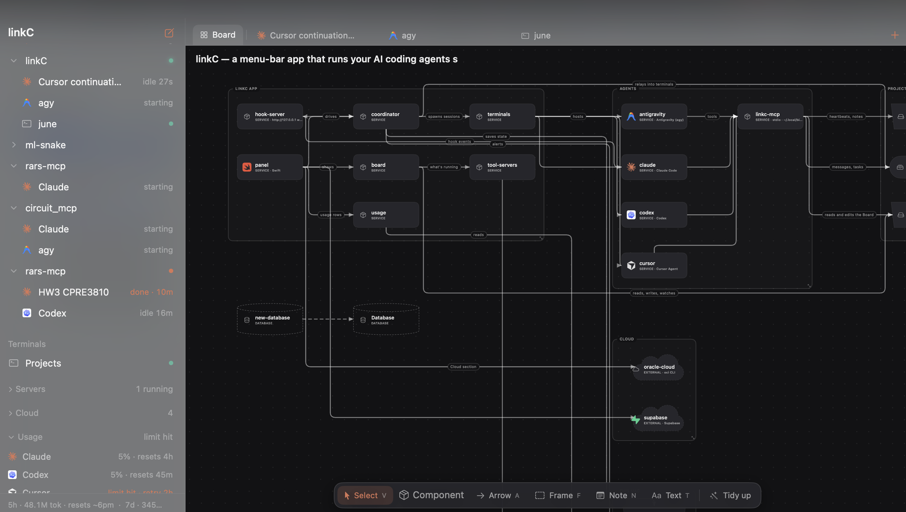
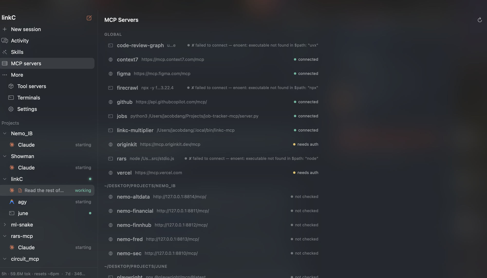

# linkC

linkC is a macOS menu-bar app for running AI coding agents side by side. It runs Claude Code,
Codex, Antigravity and Cursor Agent in one panel, shows at a glance which ones are working and
which need you, and lets them hand tasks and messages to each other.



A few terms used throughout this README:

- **Agent** — an AI coding CLI: Claude Code, Codex, Antigravity or Cursor Agent.
- **Session** — one agent running in a linkC terminal.
- **Terminal** — a plain shell, for a dev server or anything else.
- **Project** — the folder a session or terminal runs in.

## Features

### The panel and sessions

linkC has no Dock icon — click the menu-bar icon to open it. The panel opens in the top-right
corner of whichever display you last used it on, and you can drag its top edge to move it or a
corner to resize it. To open it from the keyboard, pick a shortcut in **Settings > Shortcut**:
⌥ Space, ⌃⌥ Space, ⇧⌘ L or ⌥⌘ C.

The sidebar groups sessions and terminals by project, with sections for **Projects**,
**Terminals**, **Servers**, **Cloud**, **Usage** and **Earlier**. Start an agent from a project's
**+** menu — **New session**, **Continue last** and **Resume…** all read the agent's own history,
so they find sessions you started outside linkC too. Sessions and terminals that end move to
**Earlier**; click one to start it again. Quitting linkC asks first if anything is still running,
and quitting stops it.



### Projects and terminals

Each project has a tab strip: the Board first, then a tab per session and terminal (⌘1 for the
Board, ⌘2–⌘9 for the rest). Open a plain terminal with **New terminal** in the **+** menu.

A terminal takes its name from its current folder — `~` at home, `Sources` after `cd Sources` —
unless it's running a command like `docker logs`, in which case it keeps that name. An unfiled
terminal follows your `cd`s: it shows under whatever project owns its current folder (a
subfolder doesn't count), and moves if you `cd` elsewhere. Drag a terminal onto a project to file
it there permanently — a filed terminal stays put regardless of where you `cd`. Drag it onto the
**Terminals** label, or use **Move out of** in its context menu, to unfile it. linkC remembers
each terminal's folder, so restarting one reopens it there. A terminal that exits stays in the
sidebar, output and all, until you dismiss it.

### The Board

Each project has a Board: a diagram of the system that you and your agents build together, kept
in `system-map.json` at the project root.



The tools are **Select** (V), **Component**, **Arrow** (A), **Frame** (F), **Note** (N) and
**Text** (T), plus **Tidy up** to lay out the whole diagram again along its flow. Components come in
three groups:

- **System** — database, table, cache, queue, storage, service, host, external.
- **AI agents** — agent, model, tool, MCP server, router, start, end, vector store, memory,
  prompt, state, human.
- **Hardware** — ALU, MUX, DEMUX, register, RAM, control unit, adder, decoder, clock, bus.

Arrows can be plain, conditional, control or bus; a bus arrow can carry a bit width, shown after
its label (`rs1 data  32`). Hover a component or arrow for a details card — an arrow's two ends,
label and width or style; a component's kind, description, and its inbound (**IN**) and outbound
(**OUT**) arrows. Click to pin it instead: the inspector opens on the right with the same
details, and **Edit…** (or a double-click) opens the editor.

Three lenses make dense boards easier to read: **All**, **Data** (plain and bus arrows at full
strength) and **Control** (control and conditional arrows at full strength) — linkC remembers
each Board's lens. **◎ Focus** narrows the view to the pinned item, its neighbors, and the arrows
between them; Esc leaves Focus, Esc again closes the inspector. A component can carry the logo of
its technology — PostgreSQL, Redis, Docker, and others.

Any component can have its own **detail board** for what's inside it: click **↳ Go deeper** in
the inspector or context menu, and linkC creates one if it doesn't exist yet (marked with **↳**
once it does). Detail boards live in `system-map.<slug>.json` next to `system-map.json`, and can
nest further. On a detail board, the parent component's neighbors appear as faint **ghosts** at
the edges — you can draw arrows to them but not move or edit them, and a ghost gets a ⚠ (never a
deletion) if its parent-board connection disappears. The breadcrumb at top left shows where you
are; click a segment, or press ⌘↑, to go up. The **Boards** menu lists every board in the
project, each with its own remembered position, zoom and lens.

A **table** component renders a database table's columns, with a key mark for primary and
foreign keys and a line from each foreign key to what it references. Pin a table to edit its
columns in the inspector — each edit is one undo step. The **Schema** menu imports and exports
Postgres SQL:

- **Import SQL file…** reads `CREATE TABLE` and `ALTER TABLE` statements and updates the Board.
  Tables or columns that only exist on the Board are kept and marked planned; nothing is ever
  deleted, and skipped statements are reported.
- **Import from Supabase** runs `supabase db dump` in the project folder, through your login
  shell — linkC never holds database credentials.
- **Copy SQL** and **Export SQL…** write `CREATE TABLE` statements in foreign-key order. linkC
  never runs SQL against a database.

Agents read and edit the Board through the linkC MCP server; linkC lays out the diagram again
after each edit.

### Agents that work together

linkC ships an MCP server, `linkc-mcp`, registered as `linkc-multiplier`. Its tools let agents
hand off work and share context with each other:

| Tool | Purpose |
|---|---|
| `linkc_delegate_task` | Give a task to another agent, with an optional model tier and verification. |
| `linkc_start_task` | Accept a task that linkC delivered. |
| `linkc_complete_task` | Report a task as done or failed. |
| `linkc_cancel_task` | Cancel a task. |
| `linkc_get_task` | Show the full record of a task. |
| `linkc_my_tasks` | List your open tasks. |
| `linkc_send_message` | Send a message to another agent. |
| `linkc_get_inbox` | Show the queued messages and the active agent limits. |
| `linkc_post_note` | Post a note that all agents in the project can read. |
| `linkc_broadcast_intent` | Tell the other agents your goal and your files. |
| `linkc_check_conflicts` | Find out if another agent claims a file. |
| `linkc_get_project_context` | Show the Board, and the goals and notes of the other agents. |
| `linkc_get_board`, `linkc_edit_board` | Read or edit the Board, or a detail board. The `detail` step creates a component's detail board; the `column` step adds, changes or removes a table column. |
| `linkc_get_models`, `linkc_switch_model` | List an agent's models, or change one. |
| `linkc_get_usage_status` | Show the usage each agent has left. |

linkC delivers tasks and messages by typing them into the receiving agent's terminal — every
message queued for one agent goes in as a single paste. A task can carry a model tier (light,
standard or deep), configured per agent in **Settings > Models**. A verified task also carries a
test command: linkC runs it itself, and the work only counts as done if the tests fail before it
and pass after.

When an agent hits its usage limit, its current task moves to another available agent — never
back to the one that gave it — and the limited agent rests until it actually recovers. linkC
prefers real evidence over a guess: an already-known reset time from the agent's own usage
window, or a time the limit message itself states ("try again at 3:05 PM", "in 2h 10m"), and
only falls back to a fixed cooldown when neither is available. Separately, linkC watches for a
task that stalls: no start after 10 minutes, a question left unanswered for 5 minutes, or no
screen change for 15 minutes. When one of those trips, linkC tells both you and the agent that
handed off the task.

### Usage and limits

The **Usage** section shows what each agent has left, including its 5-hour and 7-day windows
where the agent reports one. linkC reads Claude Code's 5-hour and 7-day limits from the status line it adds to each Claude
Code session, and Codex usage from session files under `~/.codex/sessions` — none of it leaves
your machine. Cursor Agent and Antigravity don't keep local usage records, so linkC can
only show a limit for them once the limit message actually appears in the terminal.

### App tabs

A project can open a local web app as a tab, added from the **Apps** section of its **+** menu;
it appears in the tab strip after sessions and terminals. linkC starts the app's server when you
open the tab and stops it — along with every process it spawned — when you close the tab or quit
linkC. It never starts an app on its own: after a restart, an app tab reads **Not running** until
you click **Start**, and if linkC stopped unexpectedly, the next launch stops whatever apps were
still running. A tab that fails to start shows the reason and the app's last output lines.
**Settings > Apps** adds apps available to every project.

### Notifications

The menu-bar icon turns coral when a session is done or needs input. linkC sends a macOS
notification only for a session you're not already watching — meaning the panel is open, linkC
is active, and that session's tab is selected. Click a notification to jump to its session.

### Other screens

- **Activity** — a timeline of agent events, with a summary per agent.
- **Skills** — the skills installed for your agents.
- **MCP servers** — your agents' global and project MCP servers, with connection status.

  

- **Tool servers** — your Docker containers and Compose projects: start, stop, restart, and open
  their logs in a terminal.
- **Settings** — launch at login, the keyboard shortcut, per-tier models, the usage footer, and
  watched endpoints.
- **Servers** (sidebar) — your running Docker servers.
- **Cloud** (sidebar) — your Oracle Cloud instances, Supabase projects, and watched endpoints.

## Supported agents

| Agent | Command | How linkC knows the session state |
|---|---|---|
| Claude Code | `claude` | Hooks push each event to a local HTTP server inside linkC. |
| Codex | `codex` | linkC reads the terminal screen once a second. |
| Antigravity | `agy` | linkC reads the terminal screen once a second. |
| Cursor Agent | `cursor` | linkC reads the terminal screen once a second. |

## Requirements

- macOS 14 or later.
- Claude Code, with `claude` on your PATH — linkC won't start without it.
- Optional: Codex (`codex`), Antigravity (`agy`) and Cursor Agent (`cursor`). linkC can only
  start an agent whose command is installed.
- Optional: Docker for the **Servers** section, and the `oci` CLI for Oracle Cloud.

## Install and run

1. Render the app icon — once, and again whenever you change it:

   ```sh
   ./scripts/make-icon.sh
   ```

2. Quit linkC if it's running, then build and install it:

   ```sh
   ./build-app.sh --install
   ```

3. Start it:

   ```sh
   open /Applications/linkC.app
   ```

4. Register the MCP server with your agents, once:

   ```sh
   ~/.local/bin/linkc-mcp --install
   ```

   This adds `linkc-multiplier` to the MCP configuration of Claude Code, Codex, Antigravity and
   Cursor Agent.

5. Allow the notification permission when macOS asks for it.

### Updating a running copy

Run `./build-app.sh` without `--install` to build `dist.noindex/linkC.app` only. Once that build
is newer than the running app, the sidebar footer shows an update button — click it to install
and restart linkC, then restart your sessions from **Earlier**.

### Signing

The app carries an ad-hoc signature, so `open` works on the Mac that built it. On any other Mac,
Gatekeeper blocks the first launch — right-click the app and choose **Open** instead.

## Build an app for linkC

An app for linkC is any local web app: linkC starts its server and shows its page in a tab.

1. Serve the app's UI as a web page from a local HTTP server.
2. Add `.linkc/app.json` to the app's root folder:

   ```json
   {
     "name": "Circuit MCP",
     "start": ["uv", "run", "python", "run_ui.py", "--port", "{port}"],
     "health": "/api/status"
   }
   ```

| Field | Required | Contents |
|---|---|---|
| `name` | Yes | The tab and menu-item name. |
| `start` | Yes | The command and arguments, run in the app's root folder through your login shell. linkC replaces each `{port}` with a free port. |
| `health` | Yes | A path starting with `/` that returns 2xx once the app is ready. |
| `path` | No | The page linkC opens. Defaults to `/`. |
| `env` | No | Environment variables for the app. |
| `port` | No | A preferred port, 1024–65535, used when free — this keeps the page on the same origin, and its local storage, across restarts. |

The server itself must:

- Listen only on `127.0.0.1`, on the port linkC gives it (also passed as `LINKC_PORT`).
- Return 2xx from `health` within 60 seconds of starting.
- Stop within 5 seconds of SIGTERM — after that, linkC SIGKILLs every process the app started.
- Write logs to stdout and stderr.
- Keep its data on disk; linkC stops the app whenever you close its tab.

linkC keeps its own data in the project's `.linkc` folder. If your repo ignores `.linkc/`, narrow
that to `.linkc/*` and add `!.linkc/app.json`.

Optional: the page URL includes `linkc=1`, so an app can hide its own header when running inside
linkC and use a dark background instead.

## Build and test

```sh
swift build   # compile
swift test    # run the unit and integration tests
```

## Source layout

| Folder | Contents |
|---|---|
| `Sources/LinkCKit/App` | The coordinator: sessions, the relay that delivers tasks and messages, the watchdog and updates. |
| `Sources/LinkCKit/Apps` | App tabs: the app manifest, the app catalog, the app process and the record of running apps. |
| `Sources/LinkCKit/Blackboard` | The shared state of a project: the inbox, tasks, messages, notes and handoffs. |
| `Sources/LinkCKit/Board` | The Board model: edits, merges, layout, arrow routing, component kinds and logos. |
| `Sources/LinkCKit/Config` | Integrations: Docker, Oracle Cloud, Supabase, MCP server health, skills and watched endpoints. |
| `Sources/LinkCKit/Core` | Domain models, agent kinds, model tiers, the session store and project grouping. |
| `Sources/LinkCKit/Git` | The Git commands for verified tasks. |
| `Sources/LinkCKit/Hooks` | Claude Code hooks: the event decoder, the local HTTP server and the settings composer. |
| `Sources/LinkCKit/MCP` | The MCP protocol, the `linkc-multiplier` tools and their registration. |
| `Sources/LinkCKit/Notify` | The focus rule and the notification delivery. |
| `Sources/LinkCKit/Preferences` | App preferences, the panel display choice and the sidebar state. |
| `Sources/LinkCKit/Terminal` | Embedded terminals, dev shells and process inspection. |
| `Sources/LinkCKit/Usage` | The usage readers for each agent, and the usage formats. |
| `Sources/LinkCKit/Verification` | The test runner for verified tasks. |
| `Sources/linkc` | The menu-bar app: the status item, the panel, the sidebar and the keyboard shortcut. |
| `Sources/linkc/Board` | The Board canvas, its tools and the project tab strip. |
| `Sources/linkc/Screens` | The Activity, Skills, MCP servers, Tool servers, Terminals and Settings screens. |
| `Sources/linkc-mcp` | The `linkc-mcp` executable. |
| `Tests/LinkCKitTests` | The unit and integration tests. |
| `scripts` | The app icon renderer, the agent skill sync script and the ThreadSanitizer script. |
